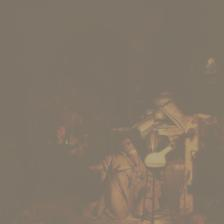
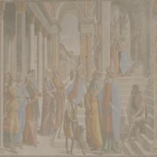

# 🎨 WikiArt Classification with CNN-LSTM

This project tackles the task of **multitask classification** on the **WikiArt Dataset**, predicting:

```
- 👨‍🎨 Artist (128 classes)
- 🖌️ Style  (27 classes)
- 🧑‍🏫 Genre  (11 classes)
```

Unlike most implementations that rely on the incomplete subset (~11k images), **this project uses the full WikiArt dataset (~81,000 paintings)**. The dataset was curated manually by scraping and mapping all artwork to the correct labels, ensuring **clean, complete, and consistent** training data.


## Results

### Predicted Images
<div align="center"> </div>

### Test Accuracy (on 6,000 unseen images)
Task	Top-1 Accuracy
```
🎨 Artist	    65.18
🧑‍🏫 Genre	       65.92%
🖌️ Style	     57.70%
```
```
Precision (W) : 0.5760
Recall    (W) : 0.5770
F1-Score  (W) : 0.5732
```

```
Note: The dataset is heavily imbalanced, especially for artists. Only a handful of artists have >1000 paintings.
```

🏆 Top 10 Most Represented Artists

```
Artist Name	            Paintings

albrecht-durer          37450+ images
vincent-van-gogh:       1673 images
nicholas-roerich:       1593 images
pierre-auguste-renoir:  1227 images
claude-monet:           1191 images
pyotr-konchalovsky:     807 images
camille-pissarro:       777 images
john-singer-sargent:    693 images
rembrandt:              685 images
pablo-picasso:          677 images
```

This shows us that the dataset is heavily imbalanced and learns to classify only the label of 'albrechet-durer' properly

However the result for the actual in-site data is projected to be better and will be updated within 24 hours


## HOW TO USE THE CODE

Implement your code using `torch.utils.data.Dataset` [an abstract class in which you can implement your own `__getitem__`]

### CREATE AN ENVIRONMENT
```bash
conda create -f env.yml
```
Here is the [env.yml file](env.yml)

### Choose a model to train
Out of the 4 different models given below choose one and import it
```
Conv_LSTM_patch.CNN_LSTM_Model [ResNet Base]
Conv_LSTM_flatten.CNN_LSTM_Model [ResNet Base but high loss]
Conv_LSTM_VGG.VGG_LSTM Model [VGG 16 Base]
COnv_LSTM_Vision_Transformer.ConvLSTM_VisionTransformer [ViT base better feature extraction]
```

```python
python train_[your_model].py
```
### Test the results
In this Repo, model weight of the ResNet model are given in the `checkpoints\ResNet\cnn_lstm_patch_model.pth`

Use the `test_model.py` script and feed your test data
```python
python test_model.py
```

## 🧠 Architecture: CNN-LSTM for Multitask Classification

I used a hybrid architecture:

```text
Pretrained ResNet18 (feature extractor)
        ↓
Feature Map: (B, 512, 7, 7)
        ↓
Reshape → (B, 49, 512)
        ↓
LSTM across spatial tokens
        ↓
3 Fully Connected Layers:
   ├── Artist  (128)
   ├── Genre   (11)
   └── Style   (27)
```

The CNN extracts local spatial patterns, and the LSTM aggregates those into a global context. This allows the model to interpret complex brushstroke patterns and composition layouts.

## Dataset

    Total Images Used: ~81,000 (scraped, validated)

    Train/Test Split: 75,000 / 6,000

    Source: Full dataset constructed from ArtGAN and raw WikiArt HTML pages with label matching.

    Preprocessing: Center-cropped, resized (224x224), normalized using ImageNet stats.


## Predictions Visualization

### Correctly Classified All 3 (Artist, Genre, Style)
<div align="center">     </div>

### Correctly Classified Any 2
<div align="center">     </div>

### Correctly Classified Any 1
<div align="center">   </div>


## Key Takeaways

    🔥 Using the full dataset significantly improves generalization and robustness.

    📉 The model struggles with less represented artists, which is expected given class imbalance.

    🧠 CNN-LSTM structure is powerful for artistic feature extraction where spatial flow matters.

    🧼 Manual dataset cleaning was crucial — mislabeled or missing paintings were discarded or mapped using raw HTML parsing.

## Future Work

    Use Vision Transformers (ViTs) for patch-level encoding.

    Add style transfer augmentation to diversify training.

    Implement active learning to improve on rare classes.

## Author

Chandradithya Janaswami
Computer Vision & AI Enthusiast